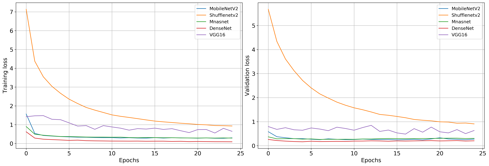

# Chinese_Zodiac_Sign_Kaggle (https://www.kaggle.com/elderyouth/chinese-zodiac-signs)
AI Track's Exercise to create a basic CNN to recognize different animals from the Chinese Zodiac

## Inference Results:
  - MobileV2
    - Test Loss: 0.301537
    - Test Accuracy: 90% (595/658)
    - Model size = 23 MB
    
  - ShuffleNetV2
    - Test Loss: 1.068708
    - Test Accuracy: 70% (465/658)
    - Model size = 17 MB
    
  - MNASNET
    - Test Loss: 0.368574
    - Test Accuracy: 89% (587/658)
    - Model size = 12 MB
    
  - DenseNet
    - Test Loss: 0.196492
    - Test Accuracy: 93% (616/658)   
    - Model size = 102 MB
  
  - Vgg16
    - Test Loss: 0.941419
    - Test Accuracy: 86% (569/658)   
    - Model size = 1 GB

## Training and Validation loss comparisons

## Deploy to Android application: 
- I deployed MNASNET trained model to a sample android application to test this out. This model give acceptable accuracy and smaller size.

Here is the demo video:

